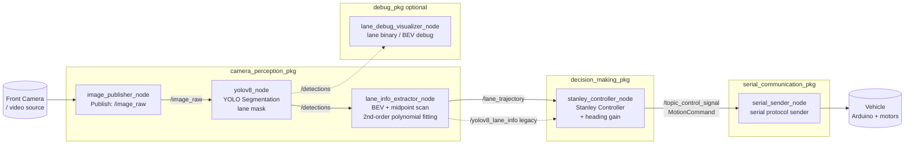
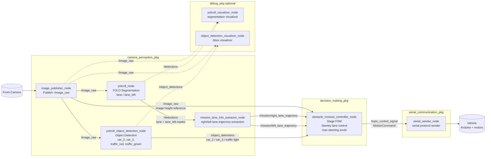
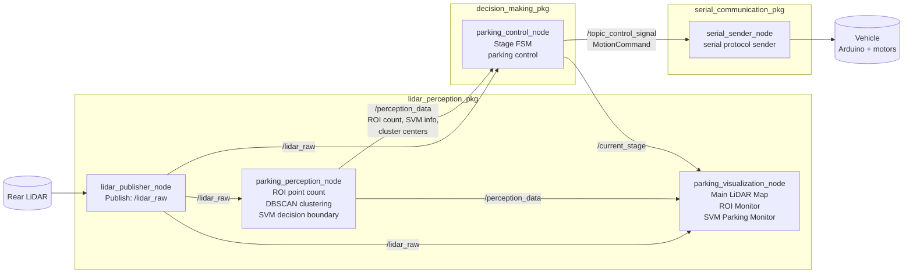

# Mission Launch Node Architecture Diagrams

> 보고서 그림 제작용 초안이다. Mermaid Live Editor 또는 Draw.io의 Mermaid import 기능으로 붙여 넣은 뒤, 박스 위치와 색상을 다듬어 PNG로 export하면 된다.

## 1. lane_keeping.launch.py 노드 구조도

**그림 설명용 문장**

시간측정 주행은 전방 카메라 기반의 단일 perception-control pipeline으로 구성된다. `image_publisher_node`가 전방 영상을 `/image_raw`로 발행하면, `yolov8_node`는 주행 가능 영역 class인 `lane`을 segmentation한다. `lane_info_extractor_node`는 segmentation mask를 BEV로 변환한 뒤 row-by-row scan으로 중심점을 추출하고, meter 좌표계에서 2차 곡선을 fitting하여 `/lane_trajectory`를 발행한다. `stanley_controller_node`는 해당 trajectory를 이용해 조향 명령을 계산하고, `serial_sender_node`가 이를 아두이노로 송신한다.

## 2. obstacle_mission.launch.py 노드 구조도

**그림 설명용 문장**

장애물 회피 및 신호등 미션은 segmentation pipeline과 object detection pipeline을 병렬로 사용한다. Segmentation 결과는 오른쪽 차선 `lane`과 왼쪽 차선 `lane_left`의 trajectory 추출에 사용되고, object detection 결과는 `car_2`, `car_3`, `traffic_red`, `traffic_green` 기반 stage 전이에 사용된다. `obstacle_mission_controller_node`는 stage 상태에 따라 오른쪽 차선 추종, 왼쪽 최대조향 회피, 왼쪽 차선 추종, 오른쪽 최대조향 회피, 빨간불 정지, 초록불 출발을 수행한다.

## 3. parking.launch.py 노드 구조도

**그림 설명용 문장**

수직 주차 미션은 후방 LiDAR만을 사용하는 구조로 구성된다. `lidar_publisher_node`가 LiDAR scan을 `/lidar_raw`로 발행하면, `parking_perception_node`는 ROI 내부 point 개수, DBSCAN cluster, SVM decision boundary를 계산하여 `/perception_data`로 발행한다. `parking_control_node`는 perception 결과와 raw LiDAR scan을 함께 사용하여 stage 기반 주차 제어 명령을 생성한다. `parking_visualization_node`는 LiDAR map, ROI monitor, SVM parking monitor를 표시하여 주차 ROI와 기준선 튜닝을 지원한다.

## Draw.io 제작 팁

1. Draw.io에서 `Arrange > Insert > Advanced > Mermaid`를 선택한다.
2. 위 Mermaid 코드 중 하나를 붙여 넣는다.
3. 패키지별 subgraph 색상을 맞춘다.
   - camera perception: 파란색 계열
   - lidar perception: 초록색 계열
   - decision making: 노란색 계열
   - serial communication: 빨간색 계열
   - debug: 회색 점선 계열
4. 토픽명은 화살표 위에 그대로 남겨두면 보고서 설명력이 좋아진다.
5. 최종적으로 PNG 또는 SVG로 export하여 보고서에 삽입한다.
